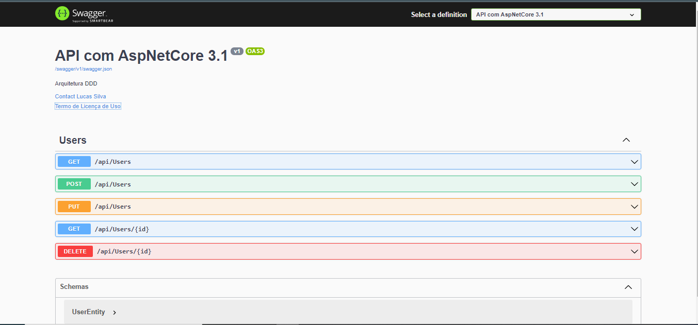

# API-.NETCore

- **Estrutura:**
    - Api.Application
    - Api.Domain
    - Api.CrossCutting
    - Api.Data
    - Api.Service

## Pacotes instalados:
    - Microsoft.EntityFrameworkCore.SqlServer
        -  dotnet add package Microsoft.EntityFrameworkCore.SqlServer --version 3.1.6
    - Pomelo.EntityFrameworkCore.MySql
        -  dotnet add package Pomelo.EntityFrameworkCore.MySql --version 3.1.1
    - Microsoft.EntityFrameworkCore.Tools 
        -  dotnet add package Microsoft.EntityFrameworkCore.Tools --version 3.1.6
    - Microsoft.EntityFrameworkCore.Design 
        -  dotnet add package Microsoft.EntityFrameworkCore.Design --version 3.1.6
    - AutoMapper.Extensions.Microsoft.DependencyInjection
        - dotnet add package AutoMapper.Extensions.Microsoft.DependencyInjection --version 6.1.1
    - System.IdentityModel.Tokens.Jwt
        - dotnet add package System.IdentityModel.Tokens.Jwt --version 5.5.0
    - Microsoft.AspNetCore.Authentication.JwtBearer
        - dotnet add package Microsoft.AspNetCore.Authentication.JwtBearer --version 3.1.6

## Criando banco de dados
    - dotnet: dotnet ef migrations add <Nome da migração>
    - dotnet: dotnet ef database update

## Resultados obitidos por meios das requisições GET, PUT, POST:
<pre>
[
    {
        "name": "usuario usuario",
        "email": "usuario2@gmail.com",
        "instituicao": "instituicao TAL",
        "tipoUsuario": "Comissão",
        "id": "0ea81b07-f17f-45d2-b4aa-a4953f76cb8e",
        "createAt": "2021-10-26T15:06:24.978678",
        "updateAt": "2021-10-26T15:12:18.377602"
    },
    {
        "name": "usuario1 usuario1",
        "email": "usuario1@gmail.com",
        "instituicao": "instituicao TAL",
        "tipoUsuario": "Comissão",
        "id": "6176f978-282e-42b7-8599-3f961fdeb490",
        "createAt": "2021-10-26T14:58:21.517226",
        "updateAt": "2021-10-26T15:13:39.578876"
    }
]
</pre>

## Swegger:

